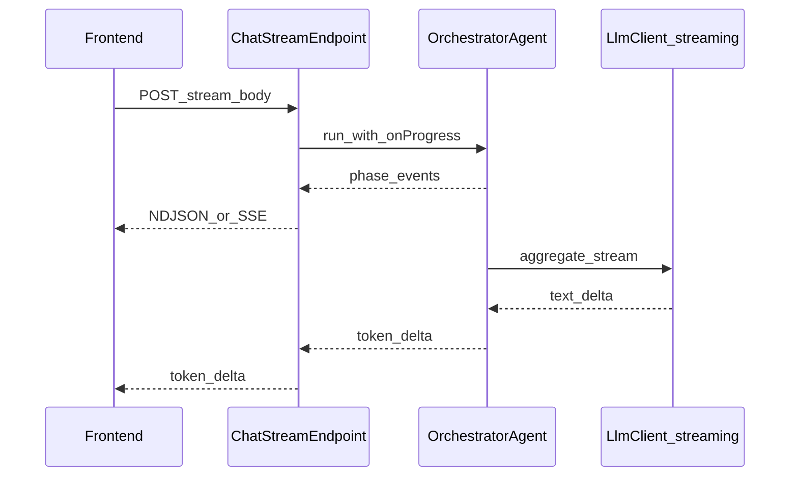

# Chat: Phase 2 – echtes Streaming & Server-Phasen

Phase 1 (aktuell) simuliert **Gedanken-Phasen** im Frontend und spielt die fertige Antwort **wortweise** nach dem synchronen `POST /api/chat` ab. Dieses Dokument beschreibt, wie man später **echte** Fortschritts- und Token-Streams wie bei Gemini/Cursor einführen kann.

## Ziele Phase 2

1. **Server-seitige Phasen:** Events z. B. nach Intent-Analyse, vor/nach Sub-Agent-Ausführung, vor Aggregation, vor Validierung – inhaltlich ehrlich, keine erfundenen Tool-Namen.
2. **Token-Streaming:** Modell-Antwort fließt als Chunks (mindestens für den sichtbaren Final-Text, typischerweise [`AggregatorAgent`](../backend/agents/aggregator.ts)).

## Architektur-Skizze



## Backend

### 1. Transportformat

- **Empfehlung:** `Content-Type: text/event-stream` (SSE) **oder** `application/x-ndjson` mit einer Zeile pro JSON-Event (einfacher mit `fetch` + `ReadableStream` zu parsen).
- **Auth:** gleiche Session/Cookies wie `POST /api/chat` ([`requireAuth`](../backend/middleware/auth.ts)).
- **Fehler:** vor Stream-Start normales JSON mit Status 4xx/5xx; **innerhalb** des Streams ein Event `{"type":"error","message":"…"}` und Verbindung schließen.

### 2. Neuer Handler (neben bestehendem JSON-Chat)

- Route z. B. `POST /api/chat/stream` oder Query `?stream=1` – **klar trennen** von Legacy-JSON, damit Clients und Tests explizit wählen.
- Refaktor: [`postChat`](../backend/services/chatService.ts) / [`AgentService.chat`](../backend/services/agentService.ts) so, dass die Orchestrierung **wiederverwendbar** ist und optional `onProgress(evt)` aufruft.

### 3. Hook-Punkte im Orchestrator

In [`OrchestratorAgent.run`](../backend/agents/orchestrator.ts) (vereinfacht):

- Nach `loadContext`
- Nach `analyzeIntent` (optional: anonymisierte Schrittanzahl / Agent-Typen **nur** wenn aus Plan wirklich bekannt)
- Vor/nach dem `Promise.allSettled` über `plan.steps`
- Vor `aggregator.aggregate`
- Vor `validator.validate`

Signatur-Idee:

```ts
type ChatProgressEvent =
  | { type: "phase"; id: string; label_de: string }
  | { type: "assistant_delta"; text: string }
  | { type: "done"; session_id: string; tool_calls_made: string[] }
  | { type: "error"; message: string };
```

### 4. LLM-Streaming

- [`LlmClient`](../backend/services/llm/llmTypes.ts) / [`AnthropicClient`](../backend/services/llm/anthropicClient.ts): neue Methode `chatStream(req, onDelta)` oder AsyncIterable von Text-Fragmenten.
- **Nur** für Calls, die **reinen Fließtext** liefern (z. B. Aggregation). Tool-Use-Pfade bleiben weiter **non-streaming**, bis Anthropic-Streaming für `tool_use` sauber modelliert ist.
- Timeouts, Retries und 529/503-Logik müssen für Streams neu bewertet werden (AbortController).

### 5. Persistenz

- Nach vollständiger Antwort weiterhin [`saveMessages`](../backend/services/agentService.ts) mit finalem String – Stream ist nur Transport, DB bleibt zeilenbasiert.

## Frontend

- `fetch(url, { headers: { Accept: "application/x-ndjson" }, body })` → `response.body.getReader()` → inkrementelles Parsen.
- State: `phaseLabel` aus Server-Events; `assistantContent` aus `assistant_delta`; bei `done` Markdown rendern (wie Phase 1: während Deltas Plaintext).
- **Fallback:** bei fehlendem Stream-Header oder älterem Backend auf `POST /api/chat` (Phase 1) zurückfallen.

## Tests

- E2E mit `page.route` auf `**/api/chat/stream` und künstlichem NDJSON-Body (Phasen + Deltas + `done`).
- Backend-Integrationstests: Mock-`LlmClient`, der Deltas liefert; prüfen, dass Events in Reihenfolge ankommen.

## Risiken / Aufwand

- Größerer Eingriff in Orchestrierung, Fehlerbehandlung und ggf. Proxies (Buffering von SSE).
- Markdown weiterhin: **erst nach `done`** voll parsen, sonst kaputte Zwischenzustände.

## Referenz-Dateien (Stand Phase 1)

- Chat-Hook: [`frontend/src/hooks/useChat.ts`](../frontend/src/hooks/useChat.ts)
- Chat-UI: [`frontend/src/pages/Chat.tsx`](../frontend/src/pages/Chat.tsx)
- JSON-Chat: [`backend/routes/chat.ts`](../backend/routes/chat.ts), [`backend/services/chatService.ts`](../backend/services/chatService.ts)
